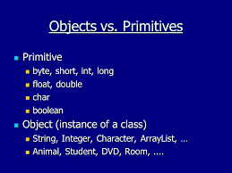
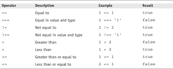
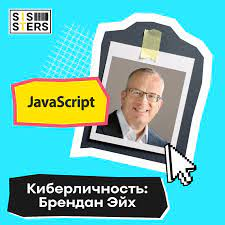
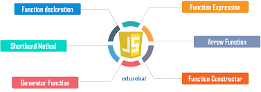

# What is Js?
> JavaScript — один из языков программирования, используемых для написания макросов в приложениях, входящих в состав OpenOffice.org. В OpenOffice.org интегрирован ...

# JAVA-SCRIPT RELEASES

>The ECMAScript specification is a standardized specification of a scripting 
language developed by Brendan Eich of Netscape initially named Mocha, then 
LiveScript, and finally JavaScript.
Learn modern JavaScript from the beginning, but without forgetting the older 
parts!
# JavaScript Variables and Constants
>In Javascript there is two types of intializing variables, var and let. You can use both of them.
However, there are some differences between them.
In programming, a variable is a container (storage area) to hold data.
If you are sure that the value of a variable won't change throughout the program, it's recommended
to use const .

# OBJECTS AND PRIMITIVES

>Primitive data types are predefined. Object data types are user-defined. These data types are held in a stack. In these data types, the original object is kept in the heap, and the reference variable is kept in the stack.
# Operators IN JavaScript

>The ** operator was introduced in ECMAScript 2016 and some browsers may not support them. To learn more, visit JavaScript exponentiation browser support.
# WHO CREATED JS

> Создатель JavaScript Брендан Эйх не так давно заново обратился к истокам созданного им языка и рассказал о том, как семена, посеянные им в 1995 
# FUNCTIONS IN JS

> Functions are one of the fundamental building blocks in JavaScript. A function in JavaScript is similar to a procedure—a set of statements